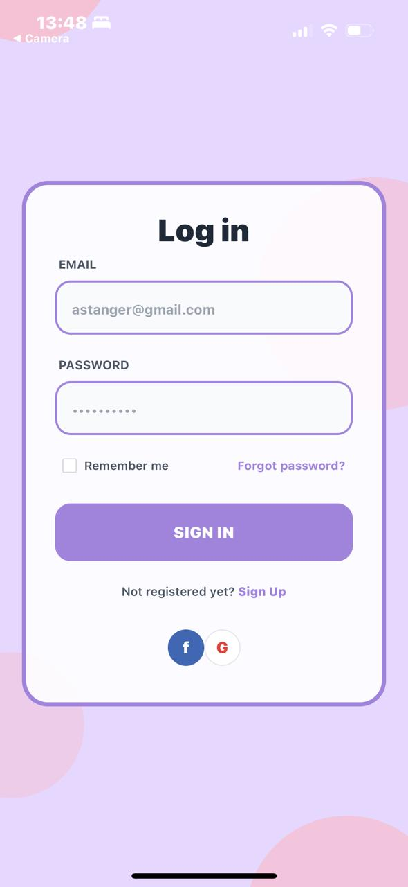
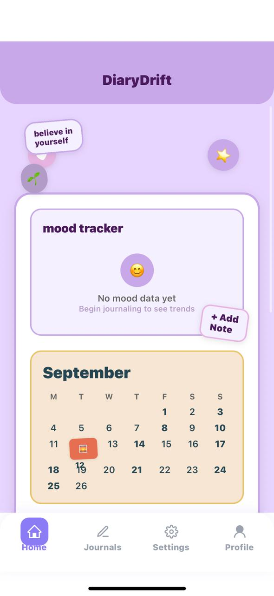
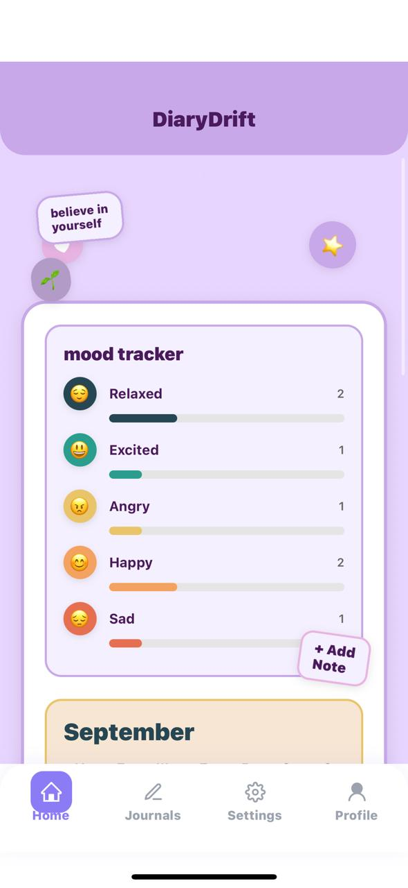
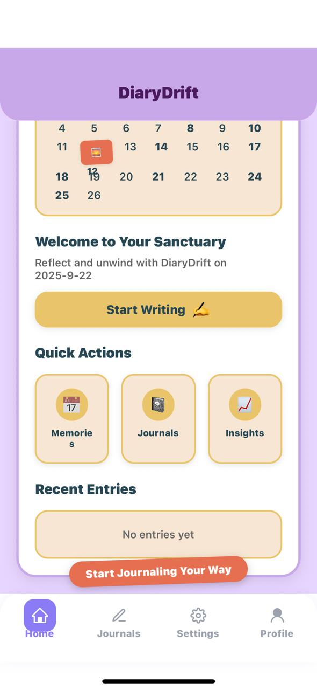
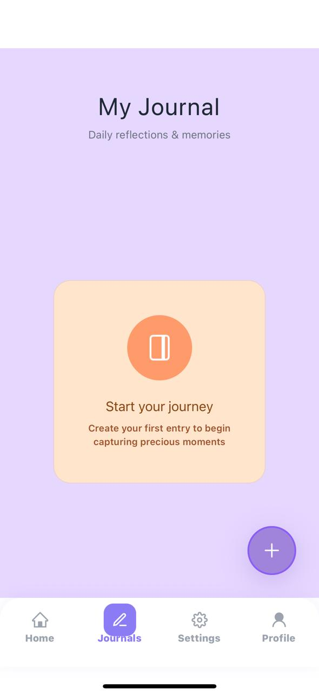
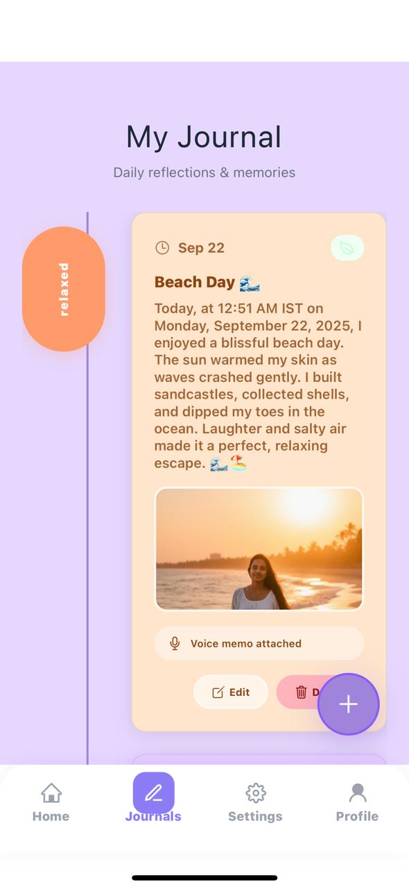
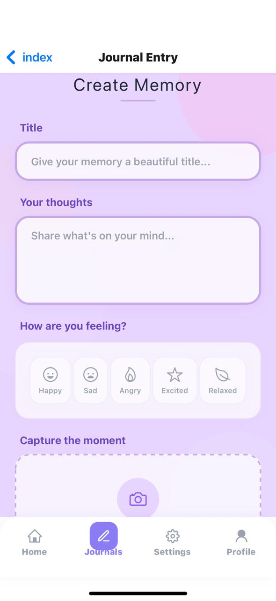
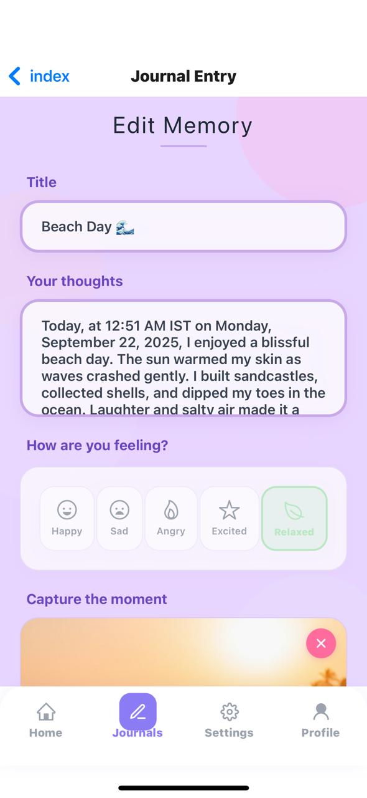
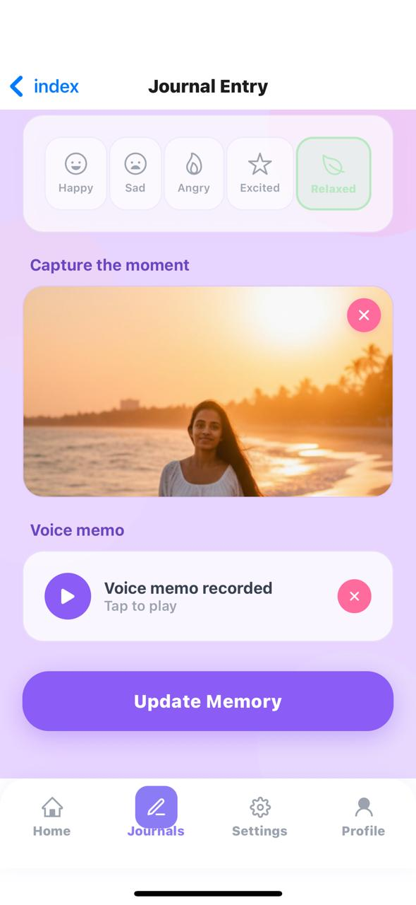
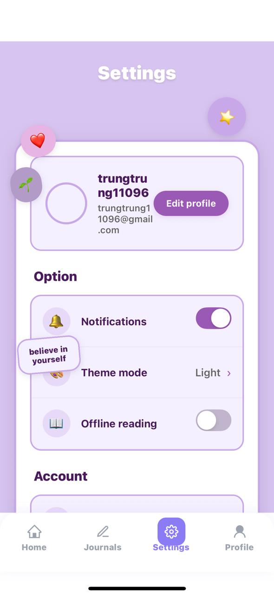

# DiaryDrift Mobile App


## Description

**DiaryDrift** is a cross-platform mobile diary application built to help users seamlessly capture, organize, and manage their daily memories. Crafted with aesthetic vibes and a modern UI, DiaryDrift [...]

The app is developed using **React Native** with **Expo**, featuring state-of-the-art tools and technologies for both frontend and backend. Data persistence and authentication are powered by **Firebas[...]  

DiaryDrift is built for Android devices, with a focus on performance, reliability, and user-centric design.

---

## Features

- **Aesthetic, Responsive UI:** Intuitive and visually pleasing design for easy navigation.
- **Cross-Platform:** Built with React Native (Expo) for Android; easily adaptable for iOS.
- **Authentication:** Secure login and registration using Firebase Auth.
- **CRUD Operations:** Create, read, update, and delete diary entries.
- **State Management:** Efficient handling of app state using Context API/Redux.
- **Custom Backend API:** Node.js-powered API for advanced data manipulation.
- **Firebase Integration:** Firestore for data storage and real-time updates.
- **Memory Management:** Save, update, delete, and retrieve all diary entries.
- **Navigation:** Stack and Tab navigation for seamless user flow.
- **Android Build:** APK-ready for easy installation.

---

## Tools & Technologies Used

- **React Native**
- **Expo**
- **Node.js** (Custom API)
- **Firebase Firestore** (Database)
- **Firebase Auth** (Authentication)
- **Redux / Context API** (State Management)
- **React Navigation** (Stack, Tab Navigation)
- **Android Build Tools**

---

## Screenshots

<div align="center">
  <table>
    <tr>
      <td></td>
      <td></td>
      <td></td>
      <td></td>
    </tr>
    <tr>
      <td></td>
      <td></td>
      <td></td>
      <td></td>
    </tr>
    <tr>
      <td></td>
      <td></td>
      <td></td>
    </tr>
  </table>
</div>

---

## Getting Started

### Prerequisites

- [Node.js](https://nodejs.org/)
- [Expo CLI](https://docs.expo.dev/get-started/installation/)
- [Firebase Account](https://firebase.google.com/)

### Installation

1. **Clone the repository:**
   ```bash
   git clone https://github.com/LakhiniVoshadee/DiaryDrift-MobileApp.git
   cd DiaryDrift-MobileApp
   ```

2. **Install dependencies:**
   ```bash
   npm install
   ```

3. **Setup Firebase:**
   - Create a Firebase project.
   - Enable Firestore and Authentication.
   - Update your Firebase config in the project.

4. **Run the app:**
   ```bash
   expo start
   ```

5. **Build for Android:**
   ```bash
   expo build:android
   ```

---

## API Endpoints

The custom Node.js API supports:
- **Create** Diary Entry
- **Read** All Diary Entries
- **Update** Diary Entry
- **Delete** Diary Entry

---

## Contributing

Pull requests are welcome! For major changes, please open an issue first to discuss what you would like to change.

---


## Author

- **Lakhini Voshadee**

---


## Demo

https://youtu.be/L0BelYrNzjI?si=qa6RcUxdoTXj6DjL

---

## Download APK

https://expo.dev/artifacts/eas/gdmBVZmLSKBkt4cHddkz8s.apk
